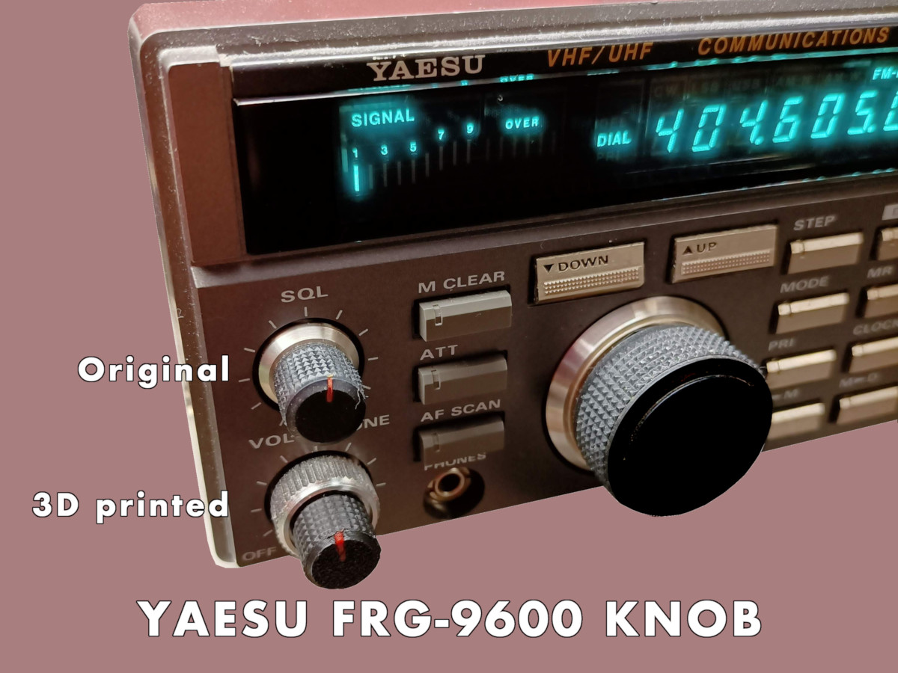

# YAESU FRG-9600 Knob

This OpenSCAD source file generates a model of the knob for the YAESU
FRG-9600 UHF/VHF radio receiver. In the ’80s, it was one of the best
receivers in its category, and it still remains a good receiver today
(although, unfortunately, there is much less to listen to now than
there was in the ’80s).

The knob model is almost identical, to the original, as you can see in
the following photo:

There are two print profiles of this knob:

- The knob will be inserted on top of the original plastic cap
- The knob will be inserted directly on the shaft

In this repository you will find:

- [The OpenSCAD Source file](FRG9600-SmallKnob-v2.scad), changing the
  value of the variable `noCap` it is possible to generate the knob
  with or without the original cap
- [The 3D model file for the Bambu Lab A1 printer](3dmodel/FRG9600-SmallKnob-v2.3mf)
  for the knob to be inserted on top of the original cap
- [The 3D model file in STL format, good for every 3D printer](3dmodel/FRG9600-SmallKnob-v2.stl)
  for the knob to be inserted on top of the original cap
- [The 3D model file for the Bambu Lab A1 printer](3dmodel/FRG9600-SmallKnob-v2-nocap.3mf)
  for the knob to be inserted directly on the shaft.
- [The 3D model file in STL format, good for every 3D printer](3dmodel/FRG9600-SmallKnob-v2-nocap.stl)
  for the knob to be inserted directly on the shaft.

